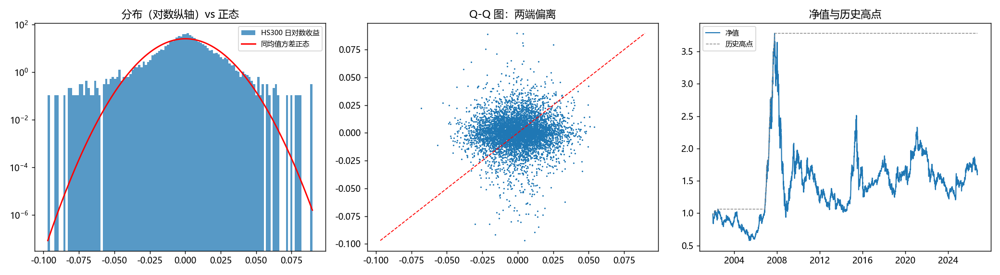

# quant-lab

量化研究员 90 天启动工程 · Day 1 已完成。

**目标**：北大金融数学方向硕士 → 头部量化研究员（因子 / Alpha 方向）。
**方法**：每天一个可交付成果，全部代码可复现、有测试、有结论。

---

## 快速开始

本机有多个 Python（Anaconda / Python 3.11 / 其他），为避免"装了却 import 不到"，
项目固定使用虚拟环境 `.venv`，命令都显式调用它的解释器。

```powershell
cd /d "E:\AI结果\量化"

# ① 环境自检（Python、依赖、matplotlib 出图、数据源）
.venv\Scripts\python.exe src\check_env.py

# ② 抓取沪深300 日线，落盘 CSV + parquet
.venv\Scripts\python.exe src\my_d01_data.py

# ③ 统计分析 + 出图
.venv\Scripts\python.exe src\my_d01_analysis.py

# ④ 单元测试（14 项，验收 5 个核心函数）
$env:D01_MODULE="my_d01_analysis"
.venv\Scripts\python.exe -m pytest src\test_d01_analysis.py -v
Remove-Item Env:\D01_MODULE

# ⑤ 推送前自查：这次会把什么推到 GitHub
.venv\Scripts\python.exe src\check_repo.py

# 装新包（永远用 python -m pip）
.venv\Scripts\python.exe -m pip install 包名
```

**不想敲命令**：双击 `运行-抓数据.bat` / `运行-做分析.bat` / `运行-全部测试.bat`。
**VS Code**：打开文件按 `F5`。

环境损坏或换电脑时重建：

```powershell
python src\make_venv.py            # 自动挑解释器、建 .venv、装依赖、验证
python src\make_venv.py --find     # 只列出本机可用解释器
```

依赖精确版本见 [docs/requirements-lock.txt](docs/requirements-lock.txt)。

---

## Day 1 成果

| 指标 | 沪深300（2002-01-07 ~ 2026-09-30，6002 个交易日） |
|---|---|
| 年化收益 | 1.93% |
| 年化波动 | 24.27% |
| 夏普（无风险利率取 0） | 0.079 |
| 最大回撤 | −75.23%（2008-11-04） |
| 峰度 | **7.695**（正态为 3） |
| \|z\|>3 实际 vs 正态 | **1.7827% vs 0.2700%**，**6.6 倍** |



**三句话结论**
1. 日对数收益峰度 7.695，正态应为 3 —— 尖峰肥尾。
2. |z|>3 实际占比是正态理论的 6.6 倍（平均 56 天一次极端行情）。
3. 因此后续因子检验不能假设正态，必须用 bootstrap 或稳健统计量。

---

## 目录

```
src/            代码（脚本、工具库、测试）
docs/           学习笔记、路线图、术语表、手册
data/raw|clean/ 数据（不入库，可由脚本重新生成）
reports/        图与结果
资料库/          公开授权教材与讲义（不入库）
```

**文档索引** → [docs/README.md](docs/README.md)

---

## 约定

1. 随机过程固定种子（`np.random.default_rng(42)`），同脚本两次运行结果必须一致。
2. 先落盘再分析，不在 notebook 里现拉数据。
3. 结论必须写清：假设、数据、检验方式、成本假设、局限。
4. 每天收工提交 Git，commit message 写清"做了什么 + 卡在哪"。
5. 推送前跑 `src/check_repo.py`：`.gitignore` 不追溯已提交的文件，靠它兜底。
