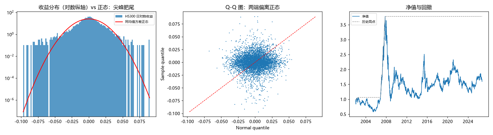

# Day 1 验收结果：沪深300 日对数收益

- 样本区间: 2002-01-07 ~ 2026-09-30
- 样本量: 6002
- 年化收益: 0.0499
- 年化波动: 0.2427
- 偏度: -0.3799
- 峰度(超额): 4.6945
- 峰度(原始): 7.6945
- 夏普(无风险0): 0.2005
- 最大回撤: -0.7523
- 日胜率: 0.5188
- |z|>2 实际占比: 0.0538
- |z|>2 正态理论: 0.0455
- |z|>3 实际占比: 0.0178
- |z|>3 正态理论: 0.0027
- Jarque-Bera 统计量: 5644.33
- Jarque-Bera p值: 0.0
- KS 统计量: 0.0757
- KS p值: 2.2909548298723876e-30
- Anderson-Darling 统计量: 82.49
- Anderson-Darling（5% 临界值(0.752)）: 0.752
- 最差单日: -0.0969
- 最好单日: 0.0897
- 说明: p 值极小 => 拒绝正态；峰度远大于 3 => 肥尾，后续所有因子检验都不能假设正态

